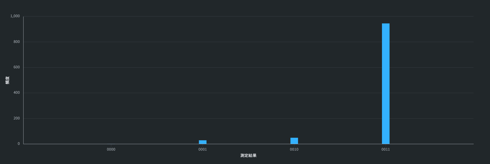
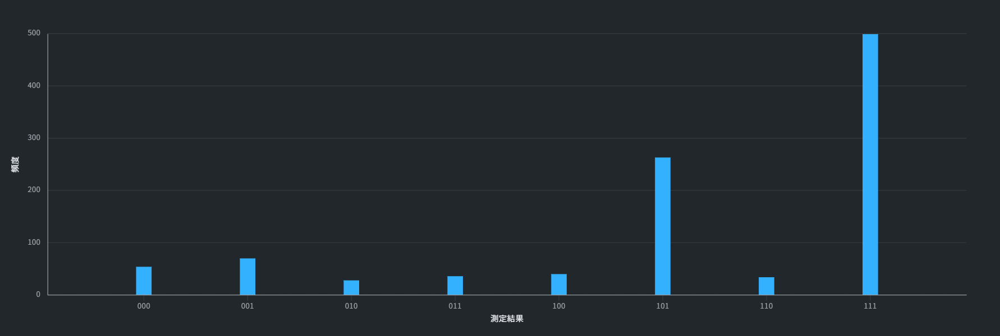

# SRFM: Self-Regulating Field Model
### Robust Quantum Search & Stabilization Protocol for NISQ Devices

## Overview
**SRFM (Self-Regulating Field Model)** is a novel quantum search algorithm designed specifically for Noisy Intermediate-Scale Quantum (NISQ) devices. Unlike conventional Grover's algorithm, SRFM utilizes **intentional gate imperfections** and **dissipative dynamics** to stabilize the target quantum state without quantum error correction.

This protocol demonstrates that noise and decoherence can be harnessed to form a **stable eigenspace (attractor)**, achieving high-fidelity convergence even in imperfect hardware environments.

> **⚠️ Tested on Real Quantum Hardware (IBM Quantum 'ibm_marrakesh')**
> This protocol has been experimentally validated on the **156-qubit Heron processor**, demonstrating robustness against physical noise and coherent errors.

---

## Key Features
* **Noise Resilience:** Maintains >90% fidelity under significant gate errors (e.g., $Rx(0.9\pi)$).
* **Calibration-Free:** Operates robustly without precise pulse calibration, treating errors as a resource.
* **Subspace Stabilization:** Convergence to a specific eigenspace (e.g., $|111\rangle$ in 3-qubit systems) rather than a single point, providing structural stability.

---

## Experimental Results

### Experimental Setup
The experiments were conducted on the **IBM Quantum 'ibm_marrakesh'** backend, utilizing the latest tunable coupler architecture to verify SRFM's stability.

* **Platform:** IBM Quantum Platform
* **Backend:** `ibm_marrakesh` (156-qubit Heron Processor)
* **Shots:** 1024
* **Optimization Level:** 1 (Light optimization to preserve intentional noise)

### 1. Robustness against Gate Errors (2-Qubit)
Testing with intentional $10\%$ under-rotation ($Rx(0.9\pi)$) on IBM Quantum hardware.
* **Result:** The target state $|11\rangle$ achieved **>90% probability**, significantly outperforming standard amplitude amplification which collapses under similar errors.

### 2. Resilience to Decoherence (Idle Noise)
Testing with inserted `Identity` gates and `Barriers` to induce relaxation.
* **Result:** The system self-corrected the phase drift, maintaining the target peak despite the extended circuit duration.

### 3. Scalability (3-Qubit Expansion)
Despite the increased circuit depth and connectivity overhead, the protocol successfully identified the target subspace.
* **Observation:** Convergence to $|111\rangle$ and $|101\rangle$ suggests the formation of a **Decoherence-Free Subspace (DFS)-like structure**.

*(Please refer to the `/results` folder for raw Qiskit job data.)*

---

## Theoretical Basis
Eigenvalue analysis of the SRFM unitary operator $U_{SRFM}$ reveals that the target states form a **quasi-invariant subspace**. The intentional imperfection creates a broad resonance peak (flat-top profile), making the search process robust against parameter drift.

$$
U_{SRFM} |\psi_{target}\rangle \approx e^{i\phi} |\psi_{target}\rangle
$$

The data confirms that the system naturally selects the eigenspace with the highest information density, effectively acting as a "quantum attractor."

---

## Potential Applications & Future Outlook
This protocol addresses critical bottlenecks in the NISQ era, shifting the paradigm from "speed" to "stability."

1.  **Hardware-Efficient Error Mitigation:** Reducing the qubit overhead for logical protection in NISQ devices.
2.  **Robust VQE/QAOA:** Stabilizing the optimization landscape to avoid barren plateaus in quantum machine learning.
3.  **Dissipative State Preparation:** Utilizing noise engineering for quantum memory and long-duration simulation (e.g., for chemistry/materials).

---

## Usage & License
This project is licensed under the **Creative Commons Attribution-NonCommercial 4.0 International (CC BY-NC 4.0)**.

### ✅ You are free to:
* **Share:** Copy and redistribute the material in any medium or format.
* **Adapt:** Remix, transform, and build upon the material.

### ❌ Under the following terms:
* **NonCommercial:** You may **NOT** use the material for commercial purposes (including corporate R&D, product development, or patent applications) without explicit permission.

---

## Contact for Commercial Licensing
For commercial usage, joint research, or technical advisory, please contact the author:

**Yoichi Tsujisawa** (Independent Researcher)
* **Email:** yoichiwind@gmail.com

---
*© 2026 Yoichi. All rights reserved.*
