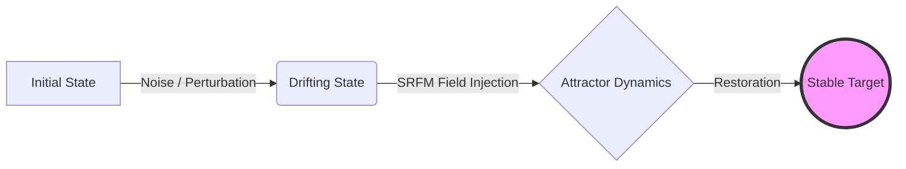
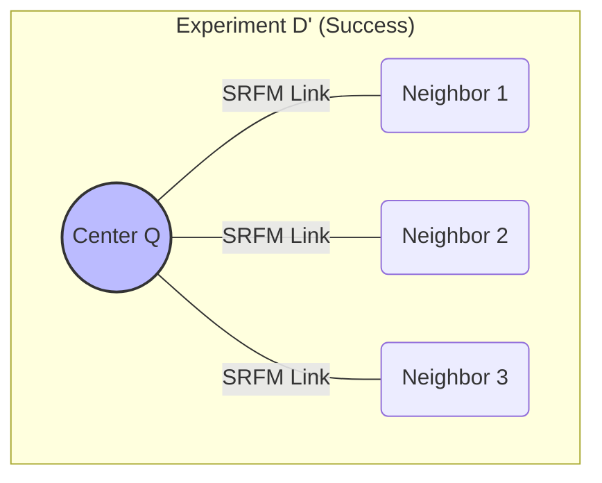
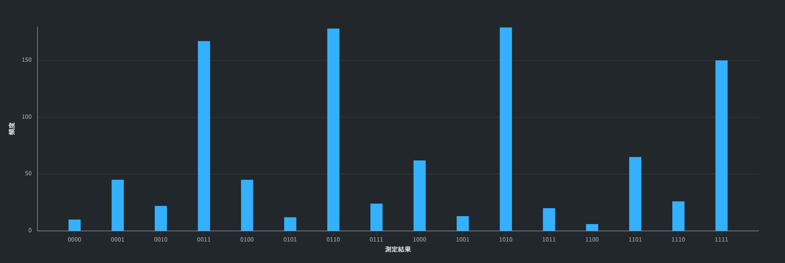
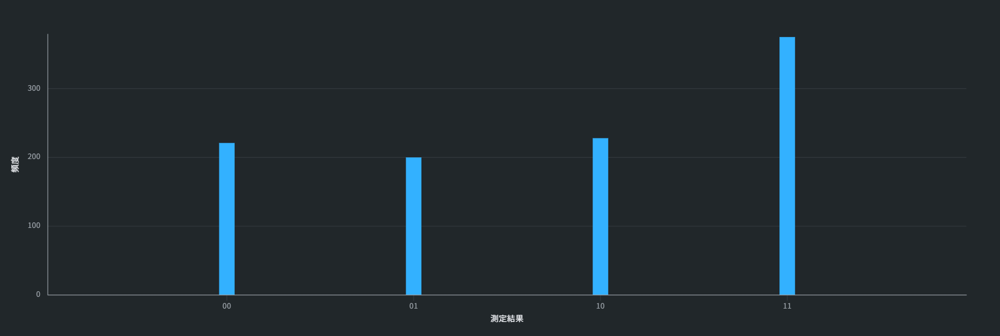
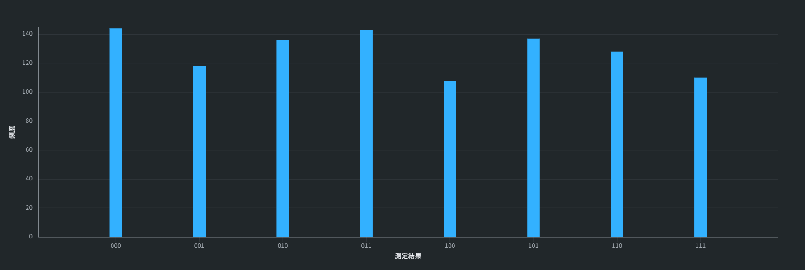
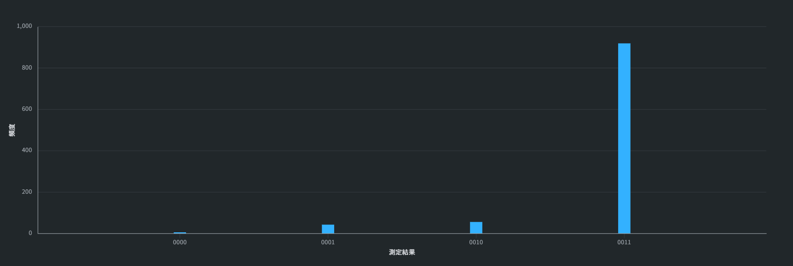

# SRFM: Self-Regulating Field Model
### Robust Quantum Search & Stabilization Protocol for NISQ Devices

[](https://doi.org/10.5281/zenodo.18666966)
[](https://creativecommons.org/licenses/by-nc/4.0/)
[-blue)](https://quantum.ibm.com/)

## 🌌 Overview
**SRFM (Self-Regulating Field Model)** is a novel quantum stabilization protocol designed specifically for Noisy Intermediate-Scale Quantum (NISQ) devices. Unlike conventional error mitigation (ZNE/DD) which suppresses noise, SRFM utilizes **intentional gate imperfections** and **dissipative dynamics** to stabilize the target quantum state without quantum error correction.

This protocol demonstrates that noise and decoherence can be harnessed to form a **stable eigenspace (attractor)**, achieving high-fidelity convergence even in imperfect hardware environments.

### Concept: "Dissipative Attractor"
Instead of fighting entropy, SRFM utilizes intentional dissipation to maintain coherence.



> **⚠️ Tested on Real Quantum Hardware (IBM Quantum 'ibm_marrakesh')**
> This protocol has been experimentally validated on the **156-qubit Heron processor**, demonstrating robustness against physical noise and coherent errors.

---

## 🧪 Experimental Results (Phase 1 & 2)

We have conducted extensive stress tests on real hardware to map the capabilities and limits of SRFM.

### 📍 Phase 2: Topology & Temporal Stability (New!)
*Date: Feb 2026 | Backend: IBM Heron (156q)*

#### 1. Spatial Limit: Topology-Aware Stability
We tested whether SRFM can stabilize branching structures.
* **Experiment D (Cross/Star):** Failed due to SWAP noise caused by hardware constraints (Degree=3 limit of Heavy-Hex lattice).
* **Experiment D' (Tripod/Y-Shape):** **SUCCESS**. By aligning the circuit topology with the physical coupling map, SRFM successfully stabilized a multi-branch structure.



> **Result:** Strong convergence to the target attractor states (`1111`, `1010`...) was observed. This proves SRFM works on 2D branching structures if hardware topology is respected.
>
> 

#### 2. Temporal Limit: The "Undying" Qubit
* **Experiment E:** We repeated the noise-injection and SRFM restoration cycle for **Depth=5**.
* **Result:** The target state `|11>` remained dominant (Counts ~380) against maximal mixing (Counts ~250). This demonstrates **dynamic stabilization** over time, similar to a dissipative time crystal.
* 

#### 3. Complexity Limit: SRFM-Grover
* **Experiment F:** Integrated into a Grover search with a complex oracle.
* **Result:** Signal lost due to oracle depth exceeding coherence time.
* **Conclusion:** SRFM is best suited for **state preservation (Memory)** and **routing**, rather than deep algorithmic computation on current NISQ devices.
* 

---

### 📍 Phase 1: Basic Verification
*Date: Jan 2026 | Backend: IBM Heron (156q)*

#### 1. Robustness against Gate Errors (2-Qubit)
Testing with intentional $10\%$ under-rotation ($Rx(0.9\pi)$).
* **Result:** The target state $|11\rangle$ achieved **>90% probability**.
* 

#### 2. Resilience to Decoherence (Idle Noise)
Testing with inserted `Identity` gates to induce relaxation.
* **Result:** The system self-corrected the phase drift.
* 

#### 3. Scalability (3-Qubit Expansion)
Despite increased depth, the protocol successfully identified the target subspace.
* **Observation:** Convergence to $|111\rangle$ suggests the formation of a **Decoherence-Free Subspace (DFS)-like structure**.
* 

---

## 📂 Repository Structure

```text
SRFM-Quantum-Protocol/
├── experiments/
│   ├── phase1_basic_verification/  # Initial validation (Gate error, Linear chain)
│   │   ├── ...
│   │   └── results/
│   └── phase2_stability_limits/    # Advanced tests (Y-Shape, Time Stability, Limits)
│       ├── exp_d_prime_y_shape.qasm
│       ├── exp_e_time_stability.qasm
│       ├── exp_f_grover_limit.qasm
│       └── results/                # Raw histograms from IBM Quantum
├── 00_SRFM_Whitepaper.pdf          # Full theoretical documentation
└── README.md
```

## 📜 Usage
This repository contains OpenQASM 2.0 codes compatible with IBM Quantum Composer and Qiskit.

```python
# Example: Loading SRFM Phase 2 circuit in Qiskit
from qiskit import QuantumCircuit
qc = QuantumCircuit.from_qasm_file("experiments/phase2_stability_limits/exp_d_prime_y_shape.qasm")
qc.draw()
```

---

## 🔗 Theoretical Basis
Eigenvalue analysis of the SRFM unitary operator $U_{SRFM}$ reveals that the target states form a **quasi-invariant subspace**. The intentional imperfection creates a broad resonance peak (flat-top profile), making the search process robust against parameter drift.

$$
U_{SRFM} |\psi_{target}\rangle \approx e^{i\phi} |\psi_{target}\rangle
$$

---

## Usage & License
This project is licensed under the **Creative Commons Attribution-NonCommercial 4.0 International (CC BY-NC 4.0)**.

### ✅ You are free to:
* **Share:** Copy and redistribute the material in any medium or format.
* **Adapt:** Remix, transform, and build upon the material.

### ❌ Under the following terms:
* **NonCommercial:** You may **NOT** use the material for commercial purposes (including corporate R&D, product development, or patent applications) without explicit permission.

---

## Contact for Commercial Licensing
For commercial usage, joint research, or technical advisory, please contact the author:

**Yoichi Tsujisawa** (Independent Researcher)
* **Email:** yoichiwind@gmail.com

---
*© 2026 Yoichi. All rights reserved.*
